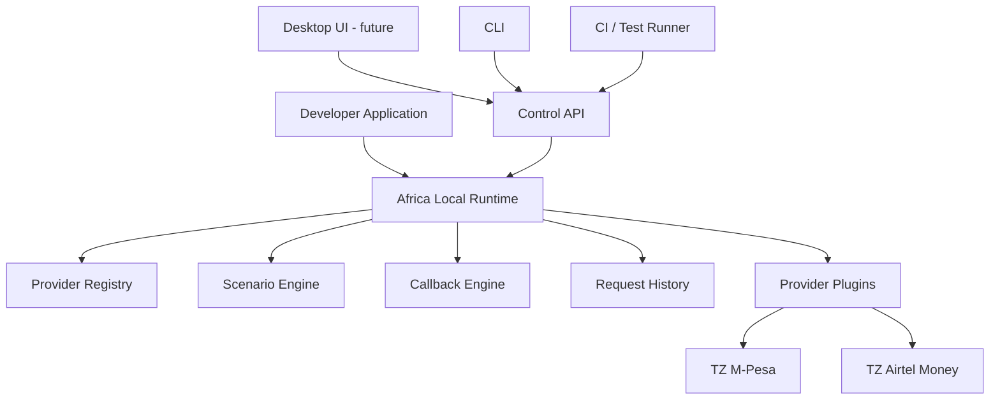

# Architecture

## Core philosophy

Africa Local's architectural source of truth is a set of language-neutral specifications
([`specs/`](specs/), [`contracts/`](contracts/)), not any programming language's types. A provider
is defined by a manifest, JSON Schemas, mapping tables, and scenario files - not by a class that
implements an interface. The Node.js runtime is one implementation of those specs; it could be
reimplemented in another language without changing a single provider directory.

```text
Specifications (specs/)
      |
      v
Contracts (contracts/)
      |
      v
Provider manifests (providers/)
      |
      v
Conformance rules (conformance/)
      |
      v
Runtime implementation (runtime/, core/)
      |
      v
CLI / Desktop UI / CI
```

## Language neutrality

Nothing about the domain model - canonical payment states, capabilities, scenario behavior,
callback semantics - is expressed as a language-specific type anywhere. It's expressed as:

- JSON Schema ([`specs/provider-manifest.schema.json`](specs/provider-manifest.schema.json),
  [`specs/scenario.schema.json`](specs/scenario.schema.json),
  [`specs/capability.schema.json`](specs/capability.schema.json),
  [`specs/event-envelope.schema.json`](specs/event-envelope.schema.json))
- A data file for the state machine
  ([`specs/state-machines/payment-lifecycle.json`](specs/state-machines/payment-lifecycle.json))
- OpenAPI/AsyncAPI ([`contracts/`](contracts/))
- Markdown for the vocabulary ([`specs/service-contract.md`](specs/service-contract.md))

The current runtime (Node.js, plain ESM JavaScript, no build step) reads these files at startup
and load-time; it does not hardcode them. See
[`adr/0002-runtime-language-and-no-build-step.md`](adr/0002-runtime-language-and-no-build-step.md)
for why Node.js was chosen for v0.1 specifically.

## Provider plugin model

A provider is a directory: `provider.yaml` (manifest) + `schemas/*.json` (request/response shapes)
+ `mappings/{statuses,errors}.yaml` (canonical result -> provider response fields) +
`scenarios/*.yaml` (declarative behavior). [`runtime/plugin-loader`](runtime/plugin-loader/)
discovers every `provider.yaml` under [`providers/`](providers/) (excluding `_template`), validates
it against `specs/`, and compiles its schemas. **Provider code is optional and, for both shipped
providers, absent** - `tz-airtel-money` differs from `tz-mpesa` only in its manifest, schemas, and
mapping tables, which is the proof that the declarative model is sufficient for a whole category of
provider (see [`providers/tanzania/airtel-money/README.md`](providers/tanzania/airtel-money/README.md)).

## Provider registry

[`core/registry/registry.yaml`](core/registry/registry.yaml) is the single list of every known
provider and its maturity (`planned` / `experimental` / `beta` / `stable` / `deprecated`). The CLI
reads it indirectly via the runtime's `/_control/providers`; `scripts/validate-registry.js`
cross-checks it against what's actually discoverable on disk in CI.

## Scenario engine

[`core/scenarios`](core/scenarios/) matches an incoming canonical request (`{phone, amount}`)
against a provider's scenario list (`match.phone`, `match.phonePattern`, `match.amountAbove/Below`)
or an explicit override set via `POST /_control/providers/{id}/scenario`. No phone number or
scenario name is hardcoded in runtime or provider code - it all comes from `scenarios/*.yaml`.

## Callback engine

[`core/callbacks`](core/callbacks/) turns a scenario's `behavior` block into scheduled HTTP
deliveries: delay, count, drop, duplicate, invalid signature, out-of-order delivery are all
generic, provider-independent mechanics. Every attempt is recorded and replayable via
`POST /_control/callbacks/{eventId}/replay`. See [`core/callbacks/README.md`](core/callbacks/README.md)
and the SSRF-relevant destination policy in [`core/callbacks/policy.js`](core/callbacks/policy.js).

## Request history

[`runtime/request-history`](runtime/request-history/) keeps a bounded (500-entry) in-memory list of
every request/response pair and every callback delivery attempt. No database, no persistence -
this is an ephemeral local development tool, not a system of record.

## Control API

[`runtime/api/control-routes.js`](runtime/api/control-routes.js) exposes `/_control/*`: health,
provider listing/detail, scenario overrides, request history, callback history and replay. This is
the **only** surface the CLI, tests, CI, and the future desktop UI are allowed to depend on - none
of them import runtime internals directly.

## Provider APIs

Every provider is mounted on the same runtime, at its manifest's `endpoints.basePath`
(`POST {basePath}/payments`, `GET {basePath}/payments/{id}`). One process, one port
(`localhost:9000` by default) - see [`runtime/README.md`](runtime/README.md#pipeline) for the
explicit request pipeline.

## Desktop UI boundary

Not built in v0.1. [`ui/desktop/`](ui/desktop/) documents its future architecture: it will consume
`/_control/*` exclusively, with **no direct provider access and no runtime logic duplicated in the
UI** - identical to how the CLI works today.



This is logical architecture, not a required distributed deployment - in v0.1 every box except
"Developer Application" and the CLI/CI callers runs inside one Node.js process.

## Conformance testing

[`conformance/`](conformance/) applies the same tests to every provider found under `providers/`
by iterating `runtime/plugin-loader` output, rather than hand-writing per-provider test files. See
[`conformance/README.md`](conformance/README.md).

## Versioning

The project, the provider manifest schema, the scenario schema, individual provider plugins, and
the Control API all version independently. See [VERSIONING.md](VERSIONING.md).

## Security boundaries

No real credentials, no real money, transparent handling of callback destinations (SSRF
guardrails, not full lockdown, because the whole point is delivering to your own machine). Full
detail: [SECURITY.md](SECURITY.md).
