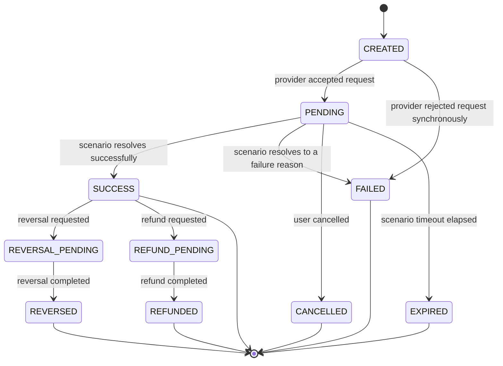

# Payment Lifecycle State Machine

This is the human-readable rendering of [`payment-lifecycle.json`](payment-lifecycle.json), the
canonical data file the runtime loads at `core/events/payment-state-machine.js`. If you change
behavior, edit the JSON first - this document should always match it.

## States

```text
CREATED
PENDING
SUCCESS            (terminal)
FAILED             (terminal)
CANCELLED          (terminal)
EXPIRED            (terminal)
REVERSAL_PENDING
REVERSED           (terminal)
REFUND_PENDING
REFUNDED           (terminal)
```

## Diagram



## Invalid transitions

Any transition not listed in `payment-lifecycle.json#transitions` is invalid, including:

- Any transition out of a terminal state other than `SUCCESS -> REVERSAL_PENDING` and
  `SUCCESS -> REFUND_PENDING`.
- Skipping `PENDING` (a payment cannot go directly from `CREATED` to `SUCCESS`).
- Any transition into `CREATED` (it is only ever the initial state).

`core/events/payment-state-machine.js` throws on an attempted invalid transition rather than
silently clamping it, so bugs in the scenario engine surface immediately.

## Callback behavior

Callbacks report the payment's canonical status at the time they are sent. A `dropCallback`
scenario still performs the state transition internally (so `GET /payments/{id}` reflects it) - it
only suppresses the HTTP delivery, to simulate a real missing-webhook incident.

## Retry behavior

Retries exist at the callback-delivery layer, not the state-machine layer. See
[callback engine docs](../../core/callbacks/README.md) - a failed callback delivery does not
change the payment's canonical status.

## Idempotency implications

- A `correlationId` (payment id) identifies one payment for its whole lifecycle.
- A callback's `eventId` is stable across redeliveries of the same logical event, so consumers can
  deduplicate on `eventId`.
- Re-querying `GET /payments/{id}` is always safe and returns the current canonical status.
