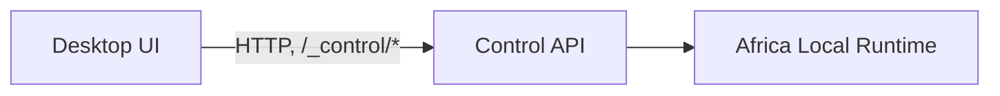

# ui/desktop (Phase 4 - not built in v0.1)

No desktop application exists yet. This directory documents its intended architecture so future
work builds on a settled design rather than inventing one under deadline pressure.

## Boundary

The desktop UI will consume **only** `/_control/*` (see
[`runtime/api/control-routes.js`](../../runtime/api/control-routes.js) and
[ARCHITECTURE.md](../../ARCHITECTURE.md#control-api)) - identical to how the CLI works today. It
will have:

- **No direct provider access.** It never calls `POST /tz/mpesa/payments` directly; that's for the
  developer's own application under test.
- **No duplicated runtime logic.** Scenario matching, callback scheduling, and state transitions
  all happen in `core/`/`runtime/`; the UI only displays what the Control API returns and issues
  the same control commands the CLI does (e.g. `POST /_control/providers/{id}/scenario`).

## Planned screens

- Provider list and status (maturity, capabilities)
- Provider detail / active scenario
- Request history and a request inspector (headers, payloads, response, scenario, duration)
- Callback history and a callback inspector, with a replay button
  (`POST /_control/callbacks/{eventId}/replay`)
- Scenario controls (the same override `POST /_control/providers/{id}/scenario` the CLI uses)
- Runtime health (`GET /_control/health`)

## Why nothing is built yet

§27/§47 of the founding spec explicitly scope a full desktop UI out of v0.1, in favor of getting
the runtime, providers, and CLI solid first. Building UI against a Control API that's still
settling would mean rebuilding it. See [ROADMAP.md](../../ROADMAP.md#phase-4---desktop).
